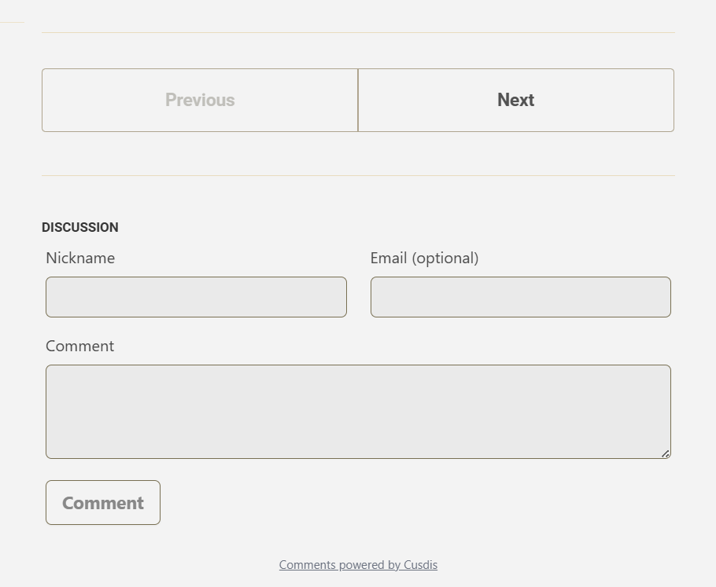
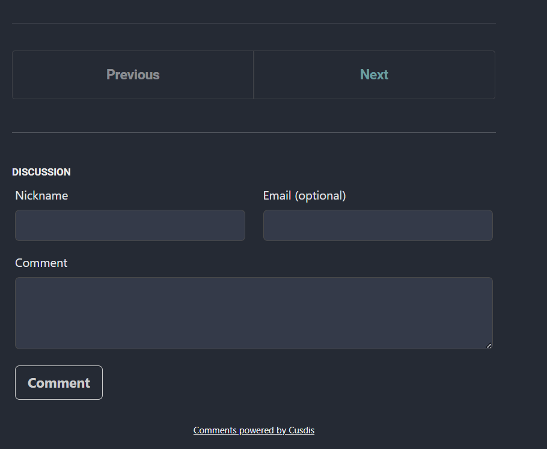
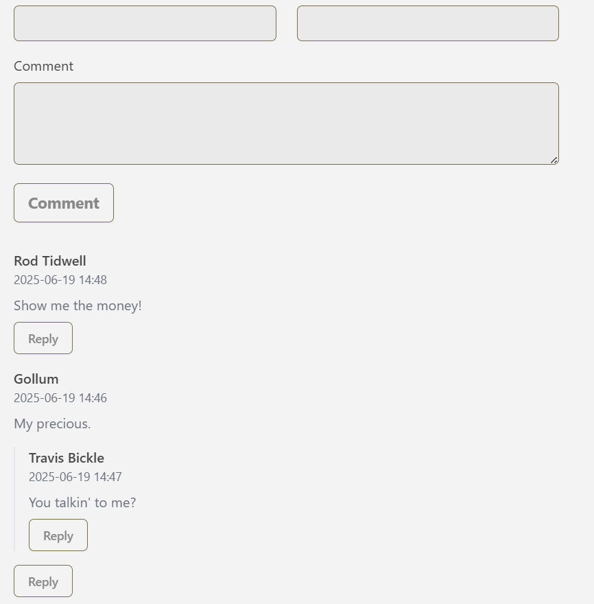
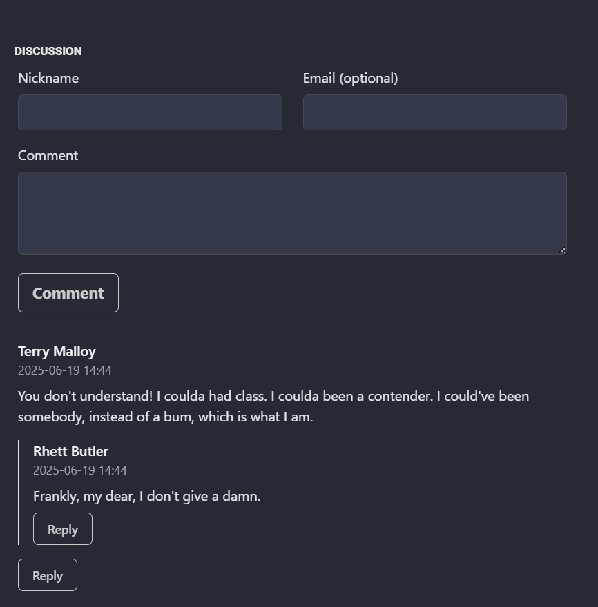

This is a modified version of [Cusdis](https://github.com/djyde/cusdis), which is an open-source, lightweight, and privacy-friendly comments provider. I modified the style to match that of my blog: [Quantified Curiosities](https://quantifiedcuriosities.com).

Modifications include:
- Changed the font to match the blog.
- Made the background transparent so it would blend in with the blog's design in light and dark modes.
- The text color switches between light and dark modes.
- Changed the design of the input boxes, and the submit and reply buttons.

You can check it out on the blog's posts, for example [Mapping the Mythos part I](https://quantifiedcuriosities.com/posts/greek-myth-network1/).

## Previews

Text input boxes and the comment button in light and dark modes.

|  |  |
|----------------|----------------|

Nested comments and reply buttons in light and dark modes.

|  |  |
|----------------|----------------|

## Usage

To use this modified version of Cusdis as is, you can self-host it by running the pre-built Docker image:

```bash
docker run -d \
  --name=cusdis-comments \
  --restart always \
  -e USERNAME={username} \
  -e PASSWORD={password} \
  -e JWT_SECRET=$(openssl rand -hex 16) \
  -e DB_TYPE=sqlite \
  -e DB_URL=file:/data/db.sqlite \
  -e NEXTAUTH_URL={host_url} \
  -e HOST={host_url} \
  -v ~/cusdis-data:/data \
  zaylaatsi/cusdis
```

Replacing the variables in curly braces with your own values.

A full description of these variables can be found in the [original Cusdis documentation](https://cusdis.com/doc#/self-host/docker).

If you want to get email notifications for new comments (which would allow you to quickly approve/reject new comments without logging in), you can add the following environment variables to the docker run command as described in the [original Cusdis documentation](https://cusdis.com/doc#/features/notification):

```bash
  -e SMTP_HOST={smtp_host} \
  -e SMTP_PORT={smtp_port} \
  -e SMTP_SECURE={smtp_secure} \
  -e SMTP_USER={smtp_user} \
  -e SMTP_PASSWORD={smtp_password} \
  -e SMTP_SENDER={smtp_sender} \
```

Of course, you can also clone this repository and build the docker image yourself, or serve the files directly following the instructions in the [original Cusdis documentation](https://cusdis.com/doc#/self-host/manual).

# Support the Project

If you enjoyed this modified version of Cusdis, please consider [supporting the original project](https://github.com/djyde/cusdis?tab=readme-ov-file#-sponsor-this-project)

# License

GNU GPLv3

